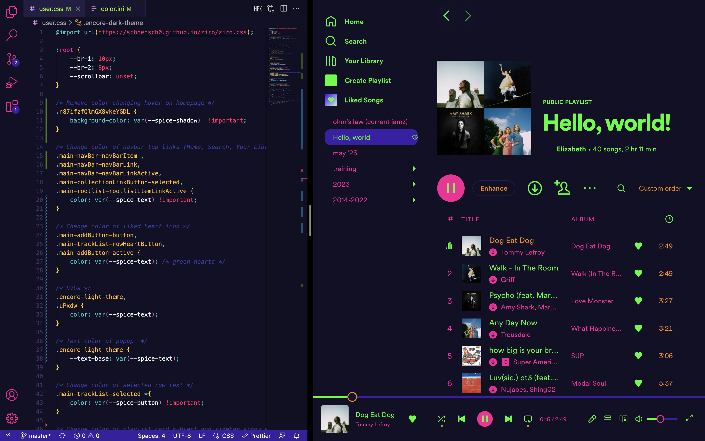

# Retreon VS Code-style Color Scheme for Spicetify Ziro Theme

### About
My custom color scheme designed for Ziro theme for Spicetify. Special thanks to [@KennyGScott](https://github.com/KennyGScott/) and [@schnensch0](https://github.com/schnensch0/) for creating the original files inspiring and contributing to this theme.
- Color scheme designed to match [Retreon VS Code Theme](https://github.com/KennyGScott/vscode-retreon/) (@KennyGScott)
- CSS base file from [Ziro Spicetify Theme](https://github.com/schnensch0/ziro) (@schnensch0)
    - Minor bug fix for overlapping playback timer/buttons due to narrow window size

### Preview
Retreon Theme in VS Code vs. Retreon/Ziro Theme applied to Spotify



### Setup (Linux/macOS)
```
cd ~/.config/spicetify/Themes
git clone https://github.com/elizabeth-c-chen/retreon-ziro.git

spicetify config current_theme retreon-ziro
spicetify apply
```
